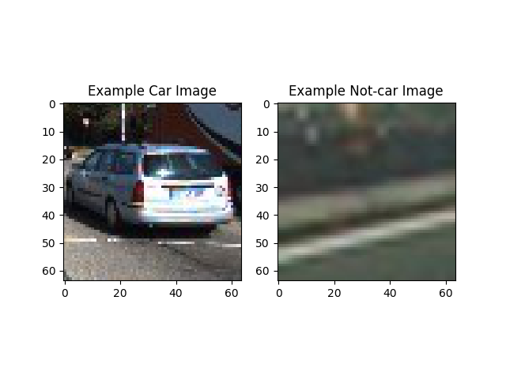
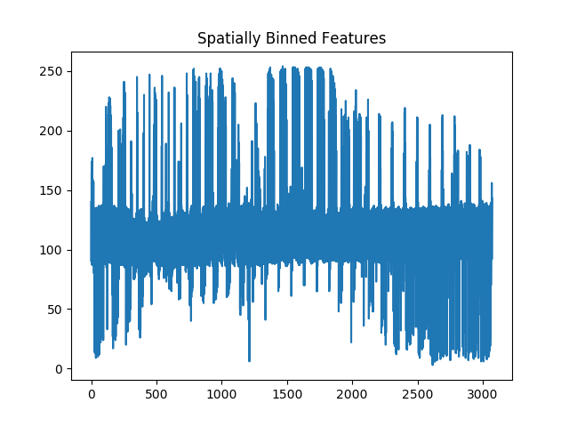
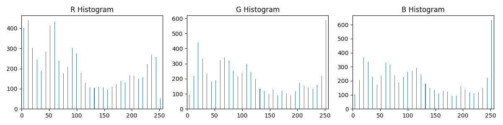
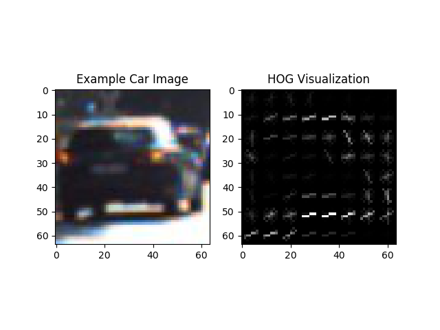
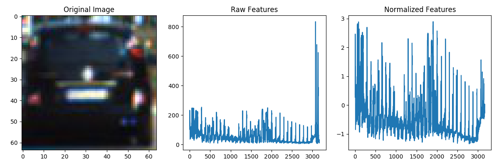
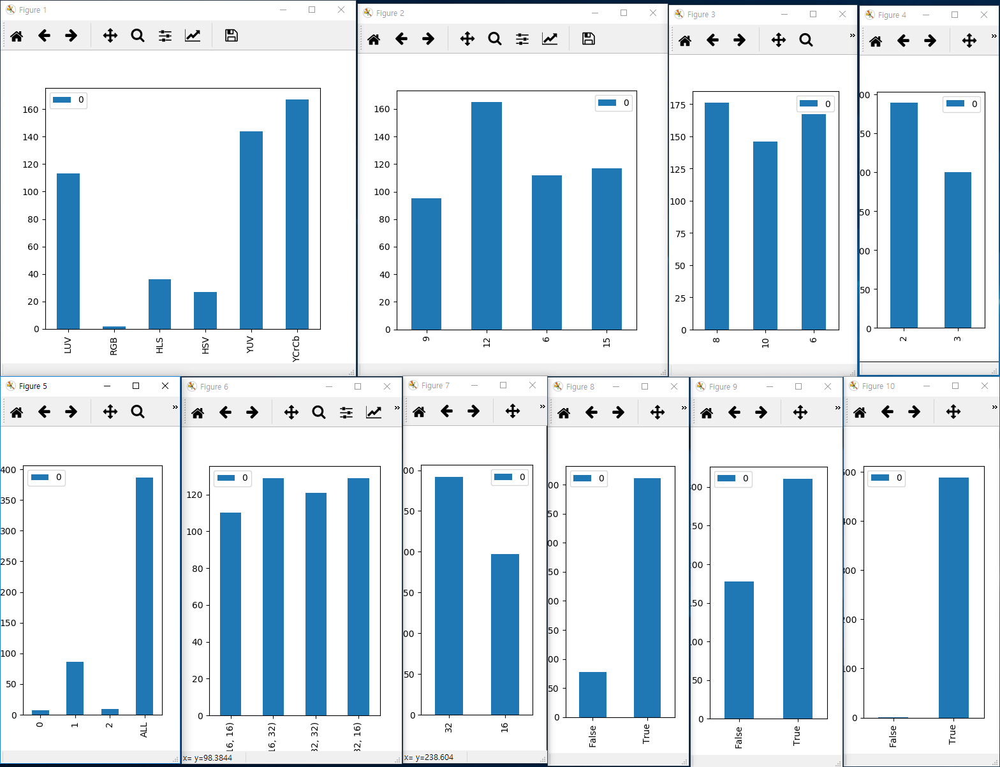
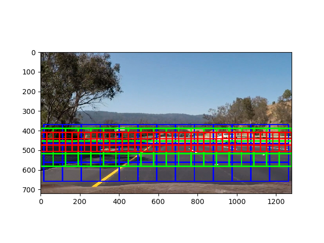
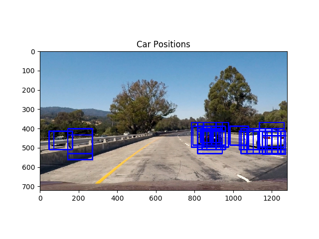
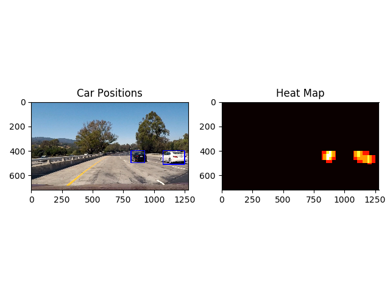

# Vehicle Detection Project

* recognizes car on the road from vision image acquired from camera mounted in a vehicle.

## Overview

* Step 1: Extract features from the labeled dataset image. The features to extract are Histogram of oriented Graidient, Histogram of color space, and binned color feature.

* Step 2: Normalize prepared feature vector to train vehicle recognition model( at this moment, it's SVM classifier).

* Step 3: Detecting vehicle area from vision image acquired from mounted camera from vision through window size and sliding rule.

* Step 4: Use a heat map to increase robustness. It only classify which object as a vehicle when it meets a certain threshold in the heat map, thereby preventing false positives.

* Step 5: Process a pipeline for video stream processing process.

## Dataset

I used the following dataset. [GTI databases](http://www.gti.ssr.upm.es/data/Vehicle_database.html) and [KITTI dataset](http://www.cvlibs.net/datasets/kitti/)

I use it as a pickle for repeated use. This pickle has not been uploaded. You can download the above dataset link and generate it by executing following my [lab code](lab/21.%20packing_data.py)

Both datasets consist of image files in 64x64x3 RGB format and the total number of data is as follows.

Class | Total Count
-----|-----
Car | 8792
Not Car | 8968

## Step 1 : Features from image
This model uses a combination of three features.

### Spatial Binning of Color
The color and appearance of the image can be recognized using spatial color features. If the size of the image is reduced, the object can be grasped to some extent. The following example shows a 64x64x3 image reduced to 32x32x3 and then extracted. [function](utils.py#L134) and [test lab](lab/5.%20spatial%20bining%20of%20color.py)

### Color Histogram

Histograms of specific color spaces give color distribution characteristics. The following is an example of a color histogram extracted from the RGB color space. [function](utils.py#L116) and [test lab](lab/3.%20color_hist.py)

### HOG Features

The HOG feature recognizes shape of the object. HOG is used as the last feature and the following shape is output.
[fucntion](utils.py#L240) and [test lab](lab/7.%20hog.py)

## Step 2 : Train Model

### Normalize Feature Vector
The three features are simply listed. The values are normalized([code](lab/8.%20norm_shuffle.py#L22)) and used for learning to make machine learning work.

### Train Model

There are many parameters that can be tuned. I used a part of dataset to conduct a full investigation of parameter combinations. I decided which parameters to use from below histogram for the results that showed an accuracy of 1.0. ([code](lab/18.%20argument_selection.py))
( *note : Python threads are somewhat different from threads in other languages. Please check [GIL](https://stackoverflow.com/questions/10789042/python-multi-threading-slower-than-serial) issue and my [code snippet](https://gist.github.com/BGPark/1792b920bbe334cfc26756c5f4e8a807). I have been working with multiple processes due to the job is CPU bound.* )

Final parameters set for the entire dataset and accuracy are as follows. The model is saved for future use. ([code](lab/14.%20store_model.py))

parameter | value
----|----
color_space | 'YCrCb'
HOG orientation | 10
HOG pixels per cell | 8
HOG cells per block | 2
HOG channel | ALL
Spatial binning dimensions | (16, 16)
Number of histogram bins | 16
Feature vector length | 6696
**Model Accuracy** | **0.987331**

## Step 3: Detecting Vehicle

### Searching Window

The default size of the window is 64x64(red grid). It has the purpose of searching the most distant vehicles. The closer distance is 1.5 times(green grid), and the closest distance is 2 times (blue grid). [Function](utils.py#L28) and [Test Lab](lab/11.%20sliding_window.py)
(*note : However, since HOG is the most expensive operation of the three feature extractions and a single operation can be reused for whole windows, it is reconstructed on the final pipeline.*)

### Detecting Vehicle

It is the result of discriminating the vehicle with the learned model by moving the window. It can be seen that a lot of positive is detected in the section where the actual vehicle object exists, and some errors are detected in the non-vehicle portion.
[function](utils.py#L479) and [test lab](lab/13.%20hog_sub-sampling.py#L47)

## Step 4 : Enhanced Robustness

using heat map and setting a threshold value([concept](lab/13.%20hog_sub-sampling.py#L74)), it made more robust.

## Step 5 : Stream Processing

Based on the previously prepared elements, I construct a pipe to process stream video and output video file.
First, set the search window area according to the search scale. As mentioned above, I use three scales group. ([scale 2](main.py#L32)) ([scale 1.5](main.py#L42)) ([scale 1](main.py#L51))

To avoid false positives while processing video frames, I simply queued the results of the previous frame([code](main.py#L56)) and apply threshold([code](main.py#L66)). The previous frame used to identify the vehicle position of the current frame was recognized as being detected only when the vehicle was detected for about 250 ms([once per 3 frames X heat 2 heat queue](main.py#L87)) based on 25 frames per second

The result video can be seen [here](output_images/project_video.mp4) or [YouTube](https://youtu.be/T3Y2Z9-Elmc).

# Discussion

This project has several improvement points.

First is to consider a vertical stabilizer compensation. I think this is the biggest reason why I can not accurately recognize the video I recorded. I checked video stream recorded by myself that detective positional change occurred too much at the moment when car passed through a kind of bumpy road.  I thought that it would be possible to adjust the top and bottom width of the image based on the speed of the vehicle, the range of image similar to the previous frame, and the like.

Second, it is a performance. It is not enough real time. The performance that can be calculated is limited, and the number of windows to be judged to detect the vehicle is too many. Analyzing the entire area of interest based on a fixed sliding window is a waste of the system. To improve this, the following two methods should be introduced. First, set up a hot place where new cars can appear. At the nearest angle, the largest window in the left and right lanes would correspond to that, and the farthest would be the smallest window near the horizon. Second, the dynamic window search is performed around the detected object. Thus, the vehicle detected once can track the changed vehicle position by discriminating only the vicinity from the next image.

Finally, it is a false positive improvement of the opposite lane. In the presence of a mediocre, a very small fraction of the car is exposed, but SVM model recognizes it as a vehicle. I would like to check if CNN model shows the same result.

